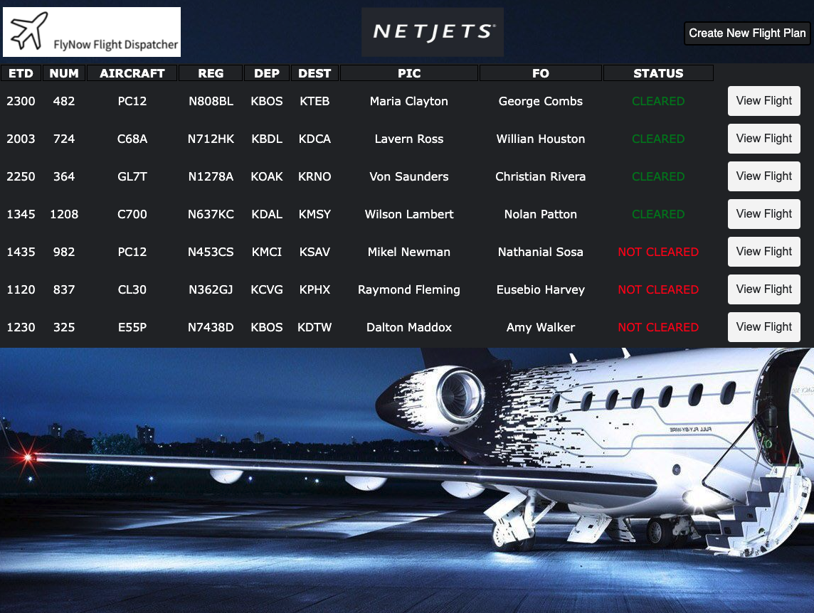

# Flight Dispatcher
Creates a database of planned flights for an airline or aircraft management company.

Database information includes basic flight information, route waypoints, and aircrew,
as well as whether or not the flight plan has been cleared.

### Technologies Used
* HTML5
* CSS3
* JavaScript
* jQuery
* Node.js
* Express.js
* MongoDB
* Mongoose

### Screenshots

### Getting Started
From the landing page, enter the dispatch portal on the flight dispatcher homepage.

Input seed data to database (if desired) by navigating to /flights/seed.

To create a new flight plan, click the button in the top right corner and input corresponding information.

To view/edit existing flight plans, click the "view flight" button.

[Click Here](https://flightdispatcher.herokuapp.com/) to go to the deployed app

### Future Enhancements
* Connecting to a flight planning API for basic airport information and weather
* Pin locations of waypoints on a map using a map API for planning visualization
* Create a pilot portal for route planning purposes