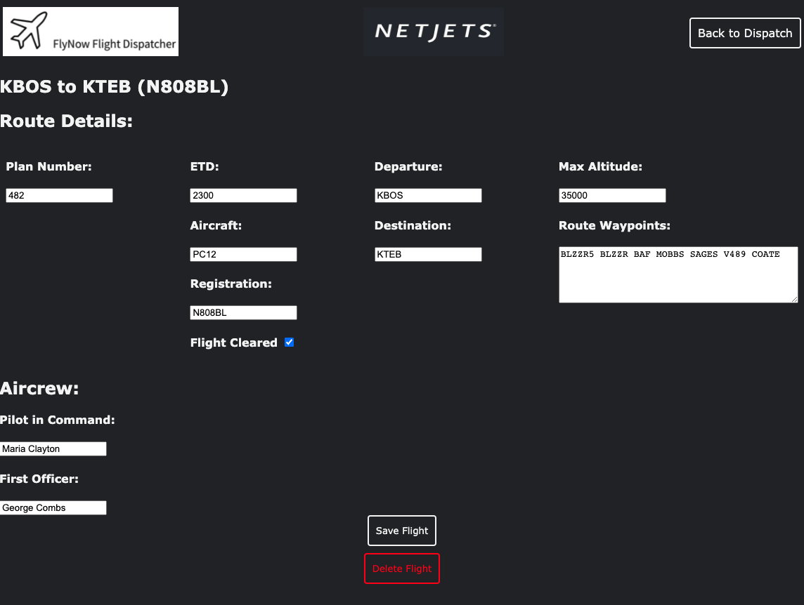

# Flight Dispatcher
Creates a database of planned flights for an airline or aircraft management company.

Database information includes basic flight information, route waypoints, and aircrew,
as well as whether or not the flight plan has been cleared.

### Technologies Used
* HTML5
* CSS3
* JavaScript
* jQuery
* Node.js
* Express.js
* MongoDB
* Mongoose

### Screenshots

### Getting Started
Enter dispatch portal on the flight dispatcher homepage.

your flight's airline (IATA code) and flight number in the search box and click "Check Flight Status" to view flight details.

[Click Here](https://maydayjimmy.github.io/Flight-Tracker-1/) to go to the deployed app

### Future Enhancements
* Connecting to a flight planning API for basic airport information and weather
* Pin locations of waypoints on a map using a map API for planning visualization
* Create a pilot portal for route planning purposes